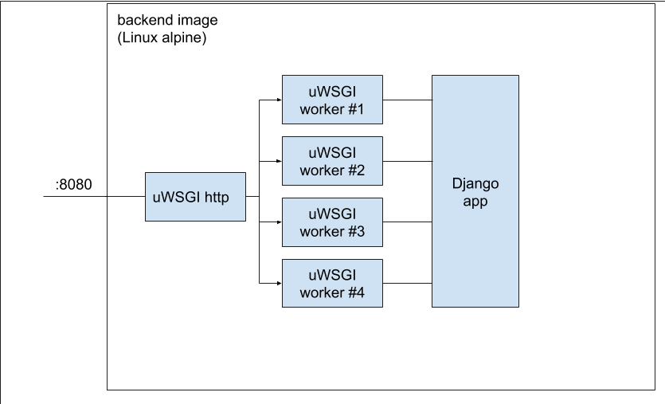

## cndsr (condenser)
cndsr is a simple URL shortening software. It's free, open source and ready to deploy basically anywhere.
cndsr comes as a set of Docker images and Kubernetes manifest files, describing the deployment process. 
Execution environment is spawned on-demand with either docker-compose (local testing, CI) 
or Kubernetes (production). Every component of cndsr is fully scalable.
   
Every commit to cndsr is tested on CI against automatic testcases written in behave. Commits to release
branches (matching pattern "release-.*") are automatically pushed to Dockerhub after successful build.

[TODO: add screenshot here :>]

#### Technologies
- Python 3
- Django
- behave
- uWSGI
- Docker, docker-compose
- Kubernetes
- redis

### Why?
Project is maintained for educational purposes.

### How to build?

#### Configure (do only once):
1. Install Python >= 3, Docker and docker-compose. They should be accessible from PATH, without sudo.
2. Clone project
```bash
git clone https://github.com/mkorman9/python-build-system.git
cd python-build-system
```
3. Setup local virtualenv
```bash
make config
```

#### Build and run feature tests locally:
```bash
make all  # or simply "make"
make validate
```

### Components

cndsr architecture consists of the following components:
1. **backend** - REST service able to store and retrieve URLs. Also performs validation and generates mapping keys.
It is entirely written in Django, and is deployed on uWSGI inside separated Docker container. Backend is stateless.
2. **frontend** - TODO
3. **storage** - distributed key:value store used to store mappings. Currently redis is used for this purpose.
4. **balancer** - HTTP load balancer. Balances traffic between frontend and backend pods. 
Every request to _/s/*_ path is redirected to one of backend pods, and every other request is handled by the frontend.
Balancer terminates HTTPS from outside the system.

#### High level system design


#### backend image


#### frontend image

