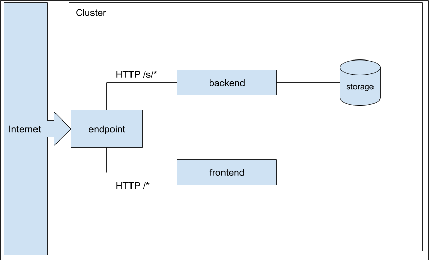

### Deployment
cndsr comes as a set of Docker images and Kubernetes manifest files, describing the deployment process. 
Execution environment is spawned on-demand with either docker-compose (local testing, CI) 
or Kubernetes (production). Every component of cndsr is fully scalable.

### Components

cndsr architecture consists of the following components:
1. **backend** - REST service able to store and retrieve URLs. Also performs validation and generates mapping keys.
It is entirely written in Django, and is deployed on uWSGI inside separated Docker container. Backend is stateless.
2. **frontend** - TODO
3. **storage** - distributed key:value store used to store mappings. Currently redis is used for this purpose.
4. **endpoint** - HTTP reverse proxy. Splits the traffic between frontend and backend pods. 
Every request to _/s/*_ path is redirected to one of backend pods, and every other request is handled by the frontend.
Endpoint terminates HTTPS from outside the system.

#### High level system design

#### backend image

#### frontend image

### CI process

Every commit is tested on CI against automatic testcases written in behave. Commits to release
branches are automatically pushed to Dockerhub after successful build.
